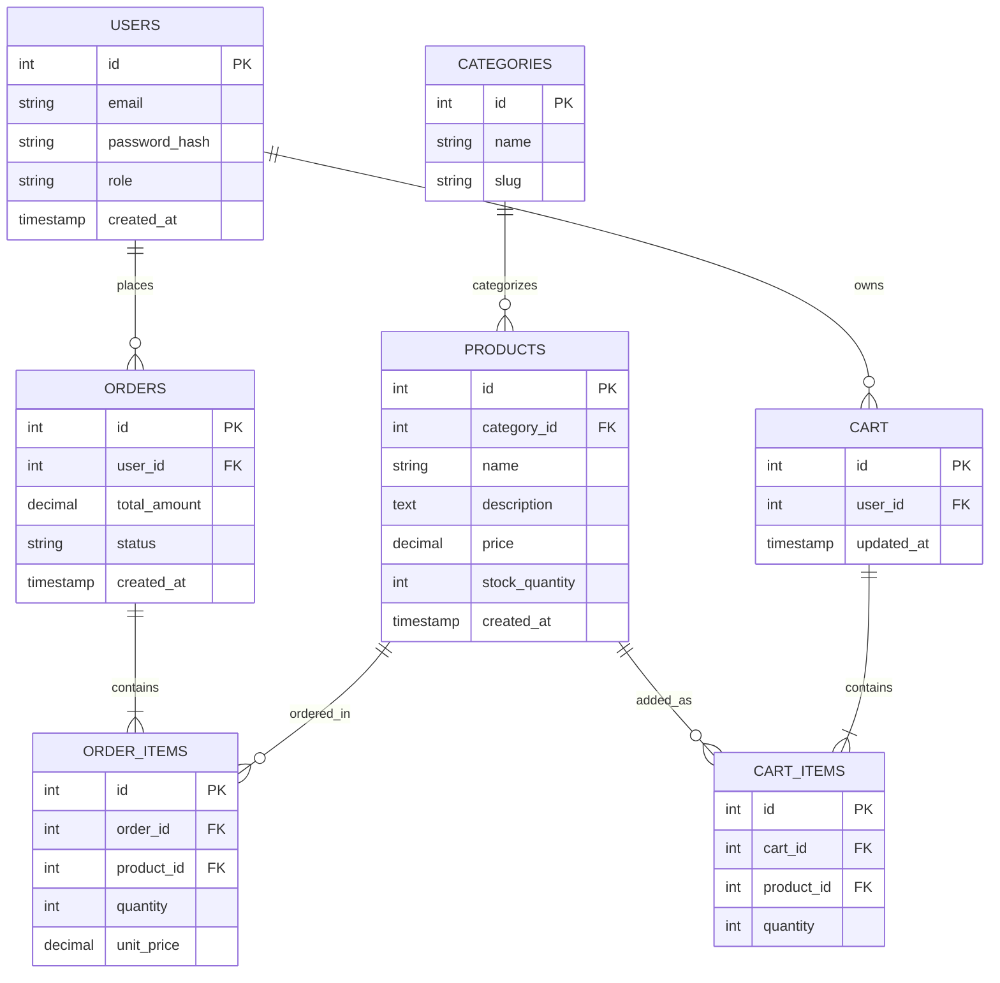

# Sprint 1: System Architecture & Scope Definition

## Section 1: Target Audience & Market Focus

- **Primary Persona:** Small independent sellers (artisans, boutique brands, and home-based businesses) who need an affordable online storefront, alongside retail consumers looking for unique, small-batch products.
- **Core Pain Point:** Small sellers currently rely on generic social media posts or expensive third-party platforms with high transaction fees, making it hard to manage inventory, process payments reliably, and present a professional catalog to buyers.
- **Domain Scope:** General Retail / Handmade & Small-Batch Consumer Goods.

## Section 2: Minimum Viable Product (MVP) Feature Scope

| Category | Feature Name | Description | Priority |
|---|---|---|---|
| Authentication | User Registration & Authentication | Password hashing (bcrypt) and JWT-based session authentication for buyers and sellers. | High (MVP) |
| Catalog | Product List & Search | Product browsing interface with category-based filtering and keyword search. | High (MVP) |
| Cart | Cart Management | State-persistent cart management (item addition, quantity update, deletion). | High (MVP) |
| Checkout | Order Processing | Mock/Stripe payment gateway integration and order object instantiation. | High (MVP) |
| Admin | Inventory Control | Seller-facing CRUD operations for product inventory and stock levels. | Medium |
| Orders | Order History & Tracking | Buyers can view past orders and current order status. | Medium |

## Section 3: Tech Stack Selection & Justification

- **Frontend Framework:** React (with Vite)
  *Justification:* Component-based architecture supports rapid iteration on catalog/cart UI, and its large ecosystem (React Router, component libraries) reduces boilerplate for a semester-length project compared to a heavier meta-framework like Next.js, which we don't need since SSR/SEO isn't a core requirement for the MVP.

- **Backend Infrastructure:** Node.js with Express
  *Justification:* JavaScript across the stack reduces context-switching for a small team, Express's minimal footprint keeps route/controller structure simple to reason about, and its middleware ecosystem (JWT, bcrypt, multer) covers all MVP auth and upload needs without extra tooling.

- **Database Management System:** PostgreSQL
  *Justification:* The domain (users, products, orders, order items) is inherently relational with strict foreign-key constraints and transactional integrity requirements (e.g., stock decrement on order placement), which favors PostgreSQL's ACID guarantees over a document store like MongoDB.

- **Caching & Asynchronous Processing (Optional):** Redis
  *Justification:* Used for session/cart caching to reduce database load on repeated cart reads, and optionally for a lightweight job queue (e.g., order confirmation emails) via Bull.

## Section 4: Entity-Relationship Diagram (ERD)

**Key constraints and cardinality:**
- `USERS (1) --- (N) ORDERS`: one user places many orders; `ORDERS.user_id` is FK → `USERS.id`.
- `ORDERS (1) --- (N) ORDER_ITEMS`: one order has many line items; `ORDER_ITEMS.order_id` is FK → `ORDERS.id`.
- `PRODUCTS (1) --- (N) ORDER_ITEMS`: a product can appear in many order items; `ORDER_ITEMS.product_id` is FK → `PRODUCTS.id`. Together, `ORDERS` and `PRODUCTS` have an N:M relationship resolved via the `ORDER_ITEMS` associative entity.
- `CATEGORIES (1) --- (N) PRODUCTS`: one category groups many products; `PRODUCTS.category_id` is FK → `CATEGORIES.id`.
- `USERS (1) --- (1) CART`: each user has exactly one active cart; `CART.user_id` is FK → `USERS.id`.
- `CART (1) --- (N) CART_ITEMS`: one cart holds many line items; `CART_ITEMS.cart_id` is FK → `CART.id`, and `CART_ITEMS.product_id` is FK → `PRODUCTS.id` (N:M between CART and PRODUCTS, resolved via `CART_ITEMS`).
