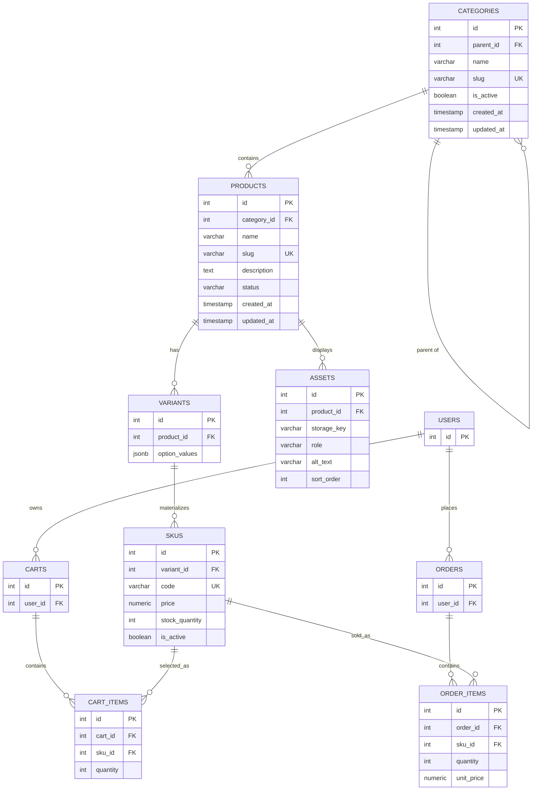

# Sprint 2: Catalog Data Foundation

## 1. Sprint Goal and Scope Boundary
Goal: build the database foundation for the catalog so that categories, products, variants and SKUs are stored without losing identity, relationships, price or stock meaning.

In scope: category tree, products, variants, SKUs, basic admin CRUD, database constraints, migrations, seed data, tests.

Out of scope (Sprint 3 or later): dynamic specifications, asset upload, public search, publication workflows, payments, orders, shipping, full checkout.

## 2. Link to Sprint 1
This sprint reuses the Sprint 1 stack (React, Node.js with Express, PostgreSQL) and extends the Sprint 1 ERD. See [SPRINT_1.md](SPRINT_1.md).

## 3. ERD and Data Dictionary

### Data Dictionary

| Table | Column | Type | Rule |
|---|---|---|---|
| categories | id | SERIAL | Primary key |
| categories | parent_id | INT | Optional FK to categories(id), ON DELETE RESTRICT; cannot equal id or become its own ancestor |
| categories | name | VARCHAR(120) | Required |
| categories | slug | VARCHAR(140) | Required, UNIQUE |
| categories | is_active | BOOLEAN | Default true |
| products | id | SERIAL | Primary key |
| products | category_id | INT | Required FK to categories(id), ON DELETE RESTRICT |
| products | name | VARCHAR(200) | Required |
| products | slug | VARCHAR(220) | Required, UNIQUE |
| products | description | TEXT | Optional |
| products | status | VARCHAR(20) | draft, active or inactive; default draft |
| variants | id | SERIAL | Primary key |
| variants | product_id | INT | Required FK to products(id), ON DELETE CASCADE |
| variants | option_values | JSONB | Example: {"size":"M","color":"Blue"} |
| skus | id | SERIAL | Primary key |
| skus | variant_id | INT | Required FK to variants(id), ON DELETE CASCADE |
| skus | code | VARCHAR(60) | Required, UNIQUE |
| skus | price | NUMERIC(10,2) | Required, CHECK price >= 0 (no floating-point money) |
| skus | stock_quantity | INT | Default 0, CHECK stock_quantity >= 0 |
| skus | is_active | BOOLEAN | Default true |

### Relationship Cardinality

- One category has many products (1:N); a category can also have many child categories (1:N).
- One product has many variants (1:N).
- One variant has many SKUs (1:N).
- One product has many assets (1:N).
- One SKU appears in many cart items and order items (1:N), so Sprint 3 links to SKU identity, not to product pricing.
## 4. Administration Routes
(to be added)

## 5. Data Integrity and Authorization Decisions
(to be added)

## 6. Seed Data and Demonstration
(to be added)

## 7. Test Strategy, Command and Result
(to be added)

## 8. Known Limitations and Sprint 3 Backlog
(to be added)
