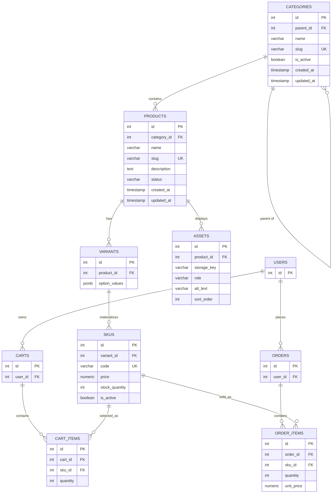

# Sprint 2: Catalog Data Foundation

## 1. Sprint Goal and Scope Boundary
Goal: build the database foundation for the catalog so that categories, products, variants and SKUs are stored without losing identity, relationships, price or stock meaning.

In scope: category tree, products, variants, SKUs, basic admin CRUD, database constraints, migrations, seed data, tests.

Out of scope (Sprint 3 or later): dynamic specifications, asset upload, public search, publication workflows, payments, orders, shipping, full checkout.

## 2. Link to Sprint 1
This sprint reuses the Sprint 1 stack (React, Node.js with Express, PostgreSQL) and extends the Sprint 1 ERD. See [SPRINT_1.md](SPRINT_1.md).

## 3. ERD and Data Dictionary

### Data Dictionary

| Table | Column | Type | Rule |
|---|---|---|---|
| categories | id | SERIAL | Primary key |
| categories | parent_id | INT | Optional FK to categories(id), ON DELETE RESTRICT; cannot equal id or become its own ancestor |
| categories | name | VARCHAR(120) | Required |
| categories | slug | VARCHAR(140) | Required, UNIQUE |
| categories | is_active | BOOLEAN | Default true |
| products | id | SERIAL | Primary key |
| products | category_id | INT | Required FK to categories(id), ON DELETE RESTRICT |
| products | name | VARCHAR(200) | Required |
| products | slug | VARCHAR(220) | Required, UNIQUE |
| products | description | TEXT | Optional |
| products | status | VARCHAR(20) | draft, active or inactive; default draft |
| variants | id | SERIAL | Primary key |
| variants | product_id | INT | Required FK to products(id), ON DELETE CASCADE |
| variants | option_values | JSONB | Example: {"size":"M","color":"Blue"} |
| skus | id | SERIAL | Primary key |
| skus | variant_id | INT | Required FK to variants(id), ON DELETE CASCADE |
| skus | code | VARCHAR(60) | Required, UNIQUE |
| skus | price | NUMERIC(10,2) | Required, CHECK price >= 0 (no floating-point money) |
| skus | stock_quantity | INT | Default 0, CHECK stock_quantity >= 0 |
| skus | is_active | BOOLEAN | Default true |

### Relationship Cardinality

- One category has many products (1:N); a category can also have many child categories (1:N).
- One product has many variants (1:N).
- One variant has many SKUs (1:N).
- One product has many assets (1:N).
- One SKU appears in many cart items and order items (1:N), so Sprint 3 links to SKU identity, not to product pricing.
## 4. Administration Routes
All routes are under /api/v1/admin and require the header `Authorization: Bearer <token>` of an administrator. No token returns 401. A non-admin token returns 403.

| Method | Route | Purpose | Success | Errors |
|---|---|---|---|---|
| POST | /api/v1/admin/categories | Create a category | 201 | 400, 401, 403, 409 |
| GET | /api/v1/admin/categories | Return the category tree | 200 | 401, 403 |
| POST | /api/v1/admin/products | Create a draft product | 201 | 400, 401, 403, 409 |
| PATCH | /api/v1/admin/products/:id | Update product content or status | 200 | 400, 401, 403, 404, 409 |
| GET | /api/v1/admin/products | List products (admin view) | 200 | 401, 403 |
| POST | /api/v1/admin/products/:id/skus | Add a SKU to a product | 201 | 400, 401, 403, 404, 409 |
| PATCH | /api/v1/admin/skus/:id | Update price, stock or active status | 200 | 400, 401, 403, 404 |

### Error format (same for every route)

{ "error": { "code": "DUPLICATE_SLUG", "message": "A product with this slug already exists" } }

### Example 1: Create a category

Request:

POST /api/v1/admin/categories
{ "name": "Clothing", "slug": "clothing", "parent_id": null }

Response 201:

{ "id": 1, "name": "Clothing", "slug": "clothing", "parent_id": null, "is_active": true }

### Example 2: Create a product

Request fields: name (required), slug (required, unique), description (optional), category_id (required).

POST /api/v1/admin/products
{ "name": "Blue Polo Shirt", "slug": "blue-polo-shirt", "description": "Cotton polo", "category_id": 2 }

Response 201:

{ "id": 1, "name": "Blue Polo Shirt", "slug": "blue-polo-shirt", "status": "draft", "category_id": 2 }

### Example 3: Add a SKU

Request fields: variant_id (required), code (required, unique), price (required, 0 or more), stock_quantity (0 or more).

POST /api/v1/admin/products/1/skus
{ "variant_id": 1, "code": "POLO-BLU-M", "price": "1500.00", "stock_quantity": 10 }

Response 201:

{ "id": 1, "variant_id": 1, "code": "POLO-BLU-M", "price": "1500.00", "stock_quantity": 10, "is_active": true }

### Example 4: Duplicate SKU rejected

Response 409:

{ "error": { "code": "DUPLICATE_SKU", "message": "SKU code already exists" } }

### Example 5: Negative stock rejected

PATCH /api/v1/admin/skus/1
{ "stock_quantity": -5 }

Response 400:

{ "error": { "code": "INVALID_STOCK", "message": "Stock quantity cannot be negative" } }
### Request fields and response shapes for the remaining routes

| Route | Request fields | Response shape |
|---|---|---|
| PATCH /products/:id | name, slug, description, status (draft, active or inactive), category_id. All optional. | 200: the updated product object |
| GET /products | none | 200: { "data": [ product objects ] } |
| GET /categories | none | 200: { "data": [ category objects, each with a "children" list ] } |
| PATCH /skus/:id | price (0 or more), stock_quantity (0 or more), is_active. All optional. | 200: the updated SKU object |

Validation errors: 400 for a missing or invalid field, 409 for a duplicate slug or SKU code, 404 when the id does not exist.
### Additional routes implemented

| Method | Route | Purpose | Success | Errors |
|---|---|---|---|---|
| POST | /api/v1/admin/products/:id/variants | Add a variant to a product. Request: option_values (JSON object, for example {"size":"M"}). Response: the variant object. | 201 | 401, 403, 404 |
| PATCH | /api/v1/admin/categories/:id | Update name, slug, parent_id or is_active. Rejects a category cycle (400, CATEGORY_CYCLE). Deactivating a parent also deactivates its children. | 200 | 400, 401, 403, 404, 409 |

## 5. Data Integrity and Authorization Decisions
### Authorization

Every /api/v1/admin route passes through an authentication middleware that verifies the JWT and then checks that the user's role is "admin". A missing or invalid token returns 401. A valid token from a non-admin user returns 403. No admin write operation runs before this check.

### Integrity rules enforced by the database

- Slugs (categories, products) are UNIQUE.
- SKU code is UNIQUE.
- Price is NUMERIC(10,2) with CHECK price >= 0. Floating-point money is not used.
- Stock quantity has CHECK stock_quantity >= 0.
- Foreign keys have explicit delete rules: category to product is RESTRICT, product to variant is CASCADE, variant to SKU is CASCADE.
- A category cannot be its own parent (CHECK id <> parent_id). Longer cycles are rejected by the API before saving.

### Business rule decisions

1. **Draft product with no SKU? Published product with no SKU?** A draft product may have no SKU because the admin is still preparing it. A product cannot become active unless it has at least one active SKU.
2. **One category or many?** One canonical category per product. This keeps the category tree and product listing simple. Many-to-many categories can be added in a later sprint.
3. **Parent category deactivated?** All its child categories are deactivated too. Products stay in the database but are not shown publicly while their category is inactive. Nothing is deleted.
4. **Out-of-stock SKU in a public response?** The SKU row still exists with stock_quantity 0 and is returned with "in_stock": false. It is not hidden and not deleted.
5. **Same price? Price override?** Two SKUs can share a price because price is not unique. In Sprint 2 each SKU has its own single price. There is no separate override; changing a SKU price is done by updating that SKU.
6. **What prevents negative stock and duplicate SKU codes?** The database: CHECK (stock_quantity >= 0) and UNIQUE (code). The API also validates first and returns a clear 400 or 409 instead of a server error.
7. **Deactivated product referenced by a future cart or order?** Rows are never hard-deleted (RESTRICT). Old orders keep working because Order_Items stores the unit_price at purchase time. A cart item that points to a deactivated SKU is marked unavailable.

## 6. Seed Data and Demonstration
### Seed data

Command (from the backend folder): `npm run seed`

The seed script clears the catalog tables and re-creates the same data every time, so it works on a clean database.

**Category tree (2 levels)**

| id | Name | Parent |
|---|---|---|
| 1 | Clothing | none |
| 2 | T-Shirts | Clothing |
| 3 | Accessories | none |

**Products, variants and SKUs**

| Product | Category | Variant options | SKU code | Price | Stock |
|---|---|---|---|---|---|
| Blue Polo Shirt | T-Shirts | size M | POLO-BLU-M | 1500.00 | 10 |
| Blue Polo Shirt | T-Shirts | size L | POLO-BLU-L | 1500.00 | 5 |
| Blue Polo Shirt | T-Shirts | size XL | none (intentionally unavailable) | - | - |
| Handmade Leather Wallet | Accessories | default | WALLET-BRN | 2200.00 | 8 |
| Ceramic Mug | Accessories | default | MUG-WHT | 800.00 | 20 |

Blue Polo Shirt has 3 variants but only 2 SKUs. The XL combination is not created as a fake zero-stock SKU (rule CAT04). In total: 3 products, 4 SKUs, 3 categories.

### Demonstration (administrator flow)

1. Run npm run seed, which prints a demo admin token (token redacted below).
2. Create a category:
   POST /api/v1/admin/categories with { "name": "Home", "slug": "home" } returns 201.
3. Create a product:
   POST /api/v1/admin/products with { "name": "Cotton Cushion", "slug": "cotton-cushion", "category_id": 4 } returns 201 with status "draft".
4. Create a variant: POST /api/v1/admin/products/4/variants with { "option_values": { "color": "Red" } } returns 201 (variant id 6).
5. Add a SKU:
   POST /api/v1/admin/products/4/skus with { "variant_id": 6, "code": "CUSH-RED", "price": "950.00", "stock_quantity": 12 } returns 201.
6. Retrieve the records:
   GET /api/v1/admin/products returns 200 with the new product in the list.
   GET /api/v1/admin/categories returns 200 with the category tree.

All requests use the header `Authorization: Bearer [REDACTED]`.

## 7. Test Strategy, Command and Result
### Test strategy

Tests use Jest and Supertest against a separate test database. Each major business rule has at least one success test and one rejection test.

Command (from the backend folder): `npm test`

| Area | Success test | Rejection test |
|---|---|---|
| Product creation | Product with required fields returns 201 | Missing name returns 400 |
| SKU creation | SKU with code, price and stock returns 201 | Missing price returns 400 |
| Duplicate slug | First product saved | Second product with same slug returns 409 |
| Duplicate SKU code | First SKU saved | Second SKU with same code returns 409 |
| Category hierarchy | Child category under a parent returns 201 | Making a category its own ancestor returns 400 |
| Stock rule | Updating stock to 0 or more returns 200 | Updating stock to -5 returns 400 |
| Price rule | Price "1500.00" is accepted | Negative price returns 400 |
| Variant/SKU combination | Only existing combinations have SKUs | No SKU is auto-created for a missing combination |
| Authorization | Admin token returns 200 or 201 | No token returns 401, non-admin token returns 403 |

### Test result

Not yet run. The test suite was written but has not been executed against a local database at the time of submission. The result will be added after running `npm test` on a computer with Node.js and PostgreSQL.

## 8. Known Limitations and Sprint 3 Backlog
### Known limitations

- Each product has one canonical category. Many-to-many categories are not supported yet.
- There is no separate price override or sale price. Each SKU has one price.
- Administrator login uses a simple seeded admin account. No password reset or multi-admin management yet.
- Category cycle detection is done in the API. The database only blocks a category being its own parent.
- Dynamic specifications, asset upload and public catalog reads are not implemented (out of scope for Sprint 2).

### Sprint 3 backlog

1. Dynamic specifications (validated JSONB or EAV tables, as chosen in Sprint 1).
2. Asset upload and image management for products and variants.
3. Public catalog reads: product list, product detail, category browsing.
4. Keyword search and category filtering.
5. Publication rules (a product can only be published with at least one active SKU).
6. Catalog-to-cart readiness: Cart_Items and Order_Items will reference SKU ids from this sprint and must not duplicate product or pricing logic.
